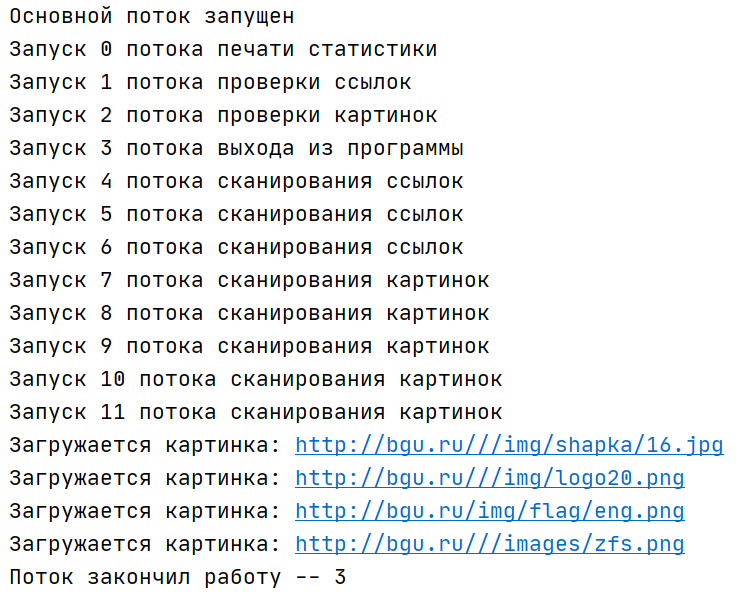

# Работа с потоками и очередями в Python
## Описание задачи
Утилита, которая в потоках рекурсивно обходит ссылки сайта и скачивает с этих страниц картинки в папку.
Начальной точкой обхода является сайт: http://bgu.ru/ .
Вся работа распределена на несколько потоков:
1. Один поток выводит на экран информацию о работе других потоков
2. По одному потоку проверки на скачивание картинки или сканирование ссылки ранее
3. Группа потоков (в данном проекте 3) для сканирования HTML-страниц из очереди и перехода по ссылкам рекурсивно
4. Группа потоков (в данном проекте 5) для скачивания картинок в папку из очереди
5. Один поток для отслеживания работы других поток. Он управляет установкой значений мьютексов mutex_warning_exit и mutex_exit, а также побуждает другие поток завершиться.

## Используются следующие элементы модулей threading и queue:
### threading.Lock - Блокировки
Класс, реализующий примитивные объекты блокировки. Как только поток получил блокировку, последующие попытки получить его блокируются, пока он не будет освобожден.

* ***lock_links*** - используется для контроля доступа к очереди ссылок на сканирование

* ***lock_imgs*** - используется для контроля доступа к очереди картинок на скачивание

### queue.Queue - Очереди
Класс, реализующий очередь FIFO (First Input First Output - первым вошел, первым вышел).

* ***q_imgs*** - используется для манипуляций с картинками на непосредственное скачивание

* ***q_links*** - используется для манипуляций с сылками для непосредственного сканирования

* ***q_msgs***  - используется для манипуляций с сообщениями для консольного вывода

* ***q_checked_imgs***  - используется для манипуляций с картинками для проверок на повтор

* ***q_checked_links***  - используется для манипуляций с ссылками для проверок на повтор


### threading.Semaphore - Семафоры
Класс, реализующий объекты семафоров. Семафор управляет атомарным счетчиком. acquire() - взятие семафора, release() - освобождение семафора.
 
* ***mutex_exit***  - мьютекс для управления безусловным выходом всех подпроцессов (потоков)

* ***mutex_warning_exit***  - мьютекс для предупреждающего действия (каждый поток вправе менять значение этого мьютекса)

### threading.Barrier - Барьеры
Класс, реализующий примитив синхронизации для использования фиксированным числом потоков, которым необходимо ждать друг друга.
 
* ***barrier***  - барьер для  4 "одиночных" потоков

* ***barrier_collect_links***  - барьер для  3 потоков сканирования ссылок
 
 * ***barrier_save_img***  - барьер для  5 потоков скачивания картинок

## Описание функций:
Перечисление представлено в том порядке, в котором эти функции инициализированы в коде.
1. ```check_mutex(num)``` - проверка глобального мьютекса для выхода потоков
2. ```check_warning_mutex()``` - проверка глобального предупредительного мьютекса для выхода потоков
3. ```check_img(barrier, num)``` - проверка картинки
4. ```check_link(barrier, num)``` - проверка ссылок
5. ```save_img(barrier, num)``` - скачивание картинок, картинки берутся из очереди q_imgs
6. ```collect_links(barrier, num)``` - пссылок и картинок, заполнение очередей для проверки ссылок и картинок
7. ```print_stat(barrier, num)``` - печать статистики (информации о работе потоков)
8. ```exit_program(barrier, num)``` - проверка условий выхода из программы и установка глобального мьютекса
9. ```main()``` - входная функция, инициалиация и запуск потоков

**P.S.** Формальные параметры для функций: 
* barrier - это барьер для одновременного старта потоков,
* num - номер потока.

## Пример выполнения

